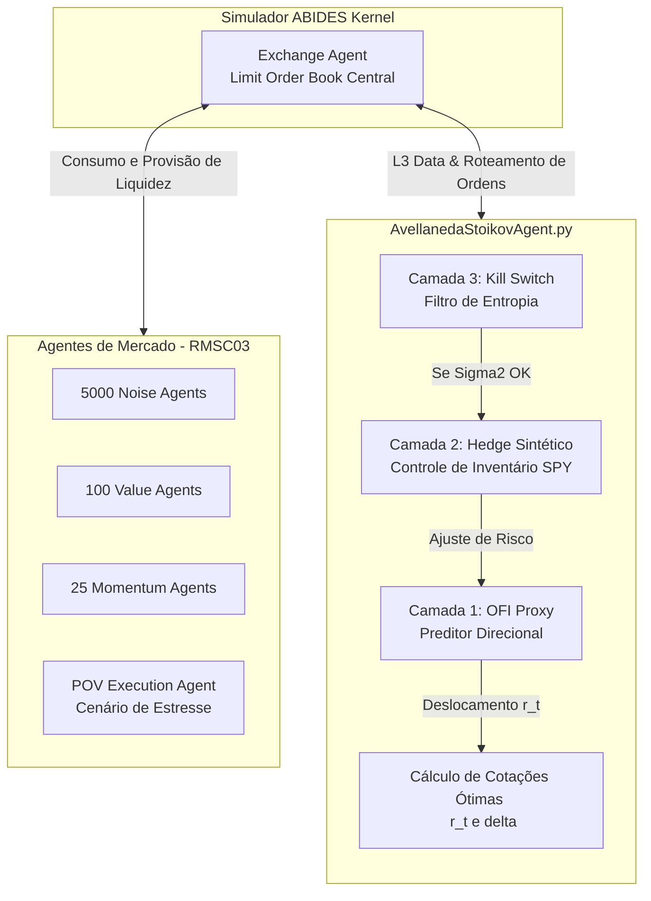

# Implementação e Análise de Market Making em LOB: Avellaneda–Stoikov em ABM

[](https://www.insper.edu.br/)
[](https://www.python.org/)
[](https://github.com/abides-sim/abides)

Este repositório contém o código-fonte, a infraestrutura de simulação e os pipelines de análise de dados do meu Trabalho de Conclusão de Curso (TCC) em Ciências Econômicas. O projeto foca na implementação, estresse e extensão do modelo estocástico de **Avellaneda-Stoikov (2008)** utilizando o simulador de microestrutura de mercado baseado em agentes **ABIDES**.

**Autor:** Bruno Drezza Reis de Souza  
**Orientador:** Prof. Raul Ikeda Gomes da Silva  
**Instituição:** Insper (Bacharelado em Ciências Econômicas)  
**Ano:** 2025  

---

## Visão Geral do Projeto
A provisão de liquidez em alta frequência (HFT) expõe os formadores de mercado ao risco de inventário e à seleção adversa extrema. Este projeto traduz as equações de controle estocástico do modelo clássico de Avellaneda-Stoikov em regras computacionais ativas, inserindo o agente em um mercado sintético realista (RMSC03). 

Ao observar a vulnerabilidade do modelo clássico a choques exógenos e fluxo informacional tóxico, este projeto propõe e implementa um **Sistema de Defesa em 3 Camadas**, mitigando perdas por meio de preditores de curtíssimo prazo e controle dinâmico de risco.

---

## Arquitetura e Fluxo de Dados

O diagrama abaixo ilustra a topologia da nossa simulação. O núcleo do projeto é o `AvellanedaStoikovAgent`, que atua de forma concorrente aos agentes de ruído e momento, comunicando-se com o *Limit Order Book* via latência simulada.



---

## O Que Foi Construído (Principais Módulos)

A infraestrutura estende o ABIDES original com os seguintes componentes autorais:

### 1. O Cérebro: `agent/market_makers/AvellanedaStoikovAgent.py`
A implementação *from scratch* da teoria em código. O agente calcula a volatilidade em tempo real (janelas móveis) e recalcula as cotações a cada milissegundo. Inclui 3 camadas de defesa paramétricas:
- **Camada 1 (OFI Proxy):** Mede o *Order Flow Imbalance* para deslocar o preço de reserva ($r_t$) preventivamente contra o fluxo direcional.
- **Camada 2 (Hedge Sintético):** Ao atingir um limite crítico de inventário, o robô trava o risco simulando a tomada de spread no ETF (SPY), descontando o custo financeiro direto no PnL.
- **Camada 3 (Kill Switch):** Monitora a variância ($\sigma^2$). Em caso de entropia/flash crash (quebra da hipótese de Movimento Browniano), o robô cancela ordens e suspende a liquidez.

### 2. A Arena: `config/rmsc03_as.py`
Configuração de ecossistema customizada. Injeta o nosso robô em um ambiente de *benchmarking* (RMSC03) contendo 5000 agentes de ruído, agentes *momentum* e a capacidade opcional de incluir um Agente Institucional de Execução (POV) para forçar exaustão de liquidez.

### 3. Orquestração e Estudo de Ablação: `run_ablation_study.py`
Um *pipeline* de automação (Grid Search) que utiliza `itertools` para iterar sobre 8 configurações arquiteturais do agente (ligando e desligando as camadas de defesa). Permite provar estatisticamente o impacto isolado de cada mitigador de risco contra o *baseline* clássico.

### 4. Telemetria e *Parsing*: `analysis/run_analysis.py`
Processador de logs pós-simulação. Descompacta os arquivos do ABIDES, filtra os eventos do `AvellanedaStoikovAgent` e plota três dinâmicas essenciais:
- Gráfico de Dinâmica de Preços (Mid-price vs Bid/Ask spread dinâmico).
- Gráfico de Evolução do Inventário ($q_t$).
- Gráfico de Análise de Impacto de Mercado (OFI e Slippage).

---

## Como Executar os Experimentos

**1. Rodar o Cenário Base (Teste Simples)**
```bash
python abides.py -c rmsc03_as -t ABM -d 20240101 -l TCC_Base
```

**2. Executar o Estudo de Ablação Completo (8 Cenários sob Estresse)**
Este script rodará todas as permutações das camadas de defesa contra uma agressão direcional de 10% do mercado.
```bash
python run_ablation_study.py
```

**3. Extrair Telemetria e Gráficos**
```bash
python run_analysis.py --log_dir log/TCC_Ablation_OFI_True_HEDGE_True_KILL_True
```
*Os gráficos em PNG serão exportados para a pasta `analysis_output/`.*
